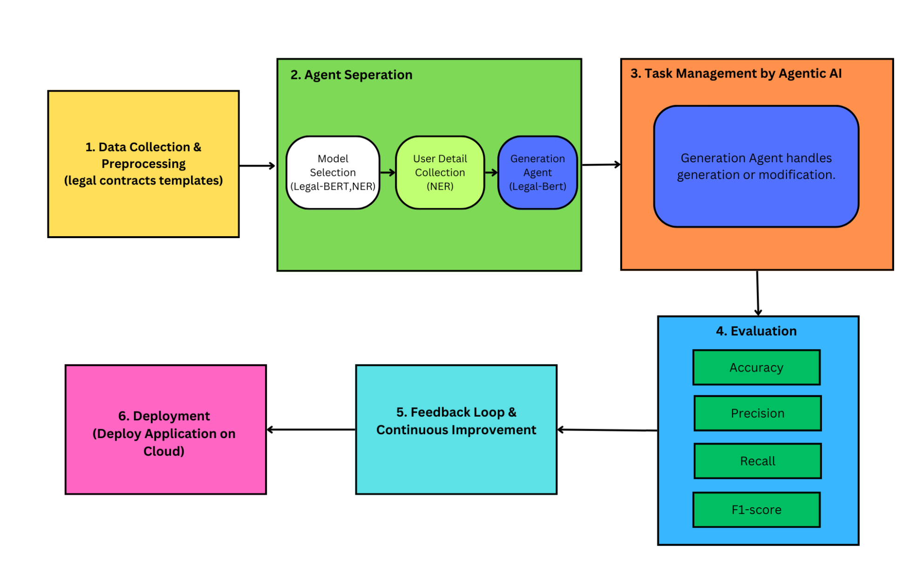
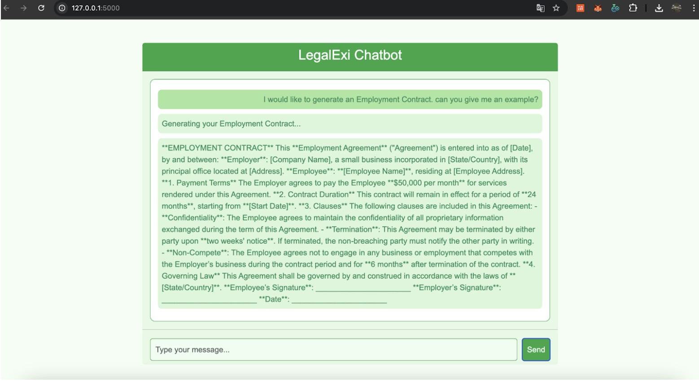

# legalexi
## Automated Legal Document Generation:
### Distilling legal complexity into clear, actionable insights.
#### Submitted by: Group 8
- Sonakul Kamnuanchai (st124738)
- Patsachon Pattakulpong (st124952)
- Nyein Chan Aung (st125553)
#### Submitted to: Dr. Chaklam Silpasuwanchai 
# Project Proposal

## Abstract

This study develops a hybrid system for automating Non-Disclosure Agreement (NDA) generation using Natural Language Processing (NLP) and template-based methods. We combine a fine-tuned Legal-BERT model for clause classification with Jinja2 template generation to process natural language requests and produce customized NDAs. Our approach aims to achieve 80% accuracy in clause classification and 75% in entity extraction, with potential to reduce NDA drafting time by 50% compared to manual methods.

---

## 1. Introduction

The automation of legal document generation, particularly Non-Disclosure Agreements (NDAs), is a rapidly growing area of interest in legal technology. NDAs play a crucial role in protecting confidential information across various industries; however, their creation often requires legal expertise and is typically time-consuming and costly. While template-based approaches have been employed to streamline this process, they still necessitate significant manual customization to meet specific requirements, which can introduce errors and inefficiencies. Recent advancements in Natural Language Processing (NLP) and machine learning, particularly with domain-specific models like Legal-BERT, offer an opportunity to automate and optimize NDA generation in a more accurate and efficient manner.

This study develops a hybrid system that combines a fine-tuned Legal-BERT model for clause classification with Jinja2 template-based generation to automate the creation of NDAs from natural language inputs. By integrating these two approaches, our system is designed to classify user inputs into appropriate legal clauses, then use a templating engine to generate a customized, legally sound NDA document. The objective is to reduce the time and effort required to draft these agreements while ensuring their accuracy and legal validity.

The motivation for this project stems from the inefficiency and inaccessibility of traditional NDA drafting methods. Many businesses, particularly small enterprises or startups, lack the resources to consult legal experts for every contract. As a result, a system that allows users, regardless of their legal expertise, to generate legally valid and customizable NDAs would provide significant value. By automating this process, we aim to make legal document generation more accessible, cost-effective, and time-efficient.

The central challenge addressed by this research is ensuring the accurate classification of user inputs into appropriate legal clauses using a fine-tuned NLP model, and subsequently generating a coherent, customized NDA that adheres to legal standards. Additionally, the system aims to improve the clarity of the generated contracts, making them comprehensible to non-experts while maintaining the necessary legal formality.

In this study, we propose a hybrid system that seeks to achieve 80% accuracy in clause classification and 75% in entity extraction, with the potential to reduce NDA drafting time by 50% compared to traditional manual methods. Through this approach, we aim to contribute to the growing field of automated legal document generation, demonstrating how NLP and machine learning can be leveraged to improve both the efficiency and accessibility of legal processes.

This work's main questions are:

- How can we effectively combine NLP techniques with template-based methods to automate the generation of legally sound NDAs?
- To what extent can a fine-tuned Legal-BERT model accurately classify user inputs into appropriate legal clause types?
- How can we use NLP to create legally valid contracts that match user input and are easy to understand for those without legal training?

By developing an NLP-powered system that generates customized contracts using pre-trained templates and user inputs, the project aims to achieve the following goals:

- **Reduce Time and Cost:** Streamline the drafting process to save users valuable time and money.
- **Enhanced Accessibility:** Provide an easy-to-use tool that empowers individuals and small businesses to create legal documents without needing expert knowledge.
- **Ensure Clarity and Compliance:** Produce contracts that are both understandable and legally sound.

This initiative seeks to bridge the gap between legal expertise and everyday users, enabling more people to confidently formalize their agreements. It also aligns with the growing demand for efficient, technology-driven solutions in an increasingly digital world.

---

## 2. Related Work

### 2.1 Review and Summary: "An Automatic Method for Building a Data-to-Text Generator"
(Zarrieß and Richardson, 2013) proposes a system for data-to-text generation, which uses a probabilistic context-free grammar (PCFG) approach to convert structured data into readable textual content. This method aligns data components from a knowledge graph with linguistic patterns, thereby automating the process of text generation. The system learns lexical and syntactic patterns from data, which is crucial for generating natural language output that accurately reflects the input data. By inducing generation rules from the data, the method offers a way to automatically generate content that is both grammatically correct and semantically aligned with the input data.

This approach can be valuable for tasks like contract generation, particularly when dealing with structured legal data. However, our focus on unstructured legal text presents different challenges that require additional techniques like legal clause extraction, classification, and template generation for automated contract creation. Nevertheless, the methodology used in this paper could inform the development of more flexible, data-driven approaches for generating legal documents, potentially integrating grammar induction techniques to improve adaptability and efficiency in contract generation.

### 2.2 Review and Summary of "Explain-Analyze-Generate: A Sequential Multi-Agent Collaboration Method for Complex Reasoning"
(Gu et al., 2025) proposes a multi-agent collaboration framework aimed at tackling complex reasoning tasks. The framework employs a sequential approach, where agents take on specialized roles: the Explainer provides logical explanations, the Analyzer performs reasoning analysis, and the Generator synthesizes the final output. The paper demonstrates how the division of labor across agents can enhance task performance, with each agent handling distinct components of the reasoning process.

The EAG framework was applied to complex reasoning tasks in a BBH benchmark, where different agents cooperated to generate high-quality reasoning outputs. The key innovation of this work lies in its ability to divide reasoning tasks into specialized, sequential processes, enabling agents to work efficiently without overlapping their functions. This method is relevant to our contract processing project, as it highlights the benefits of separating distinct tasks—such as contract summarization and content generation—into specialized roles, thereby optimizing performance and improving accuracy.

In conclusion, while the EAG framework is focused on complex reasoning across diverse tasks, its methodology of agent specialization and sequential collaboration provides a promising approach that could be adapted for legal contract processing. By applying a similar framework to our project, we can ensure that each agent focuses on a specific task in contract processing, such as analyzing legal clauses and generating the contract content, which will improve the overall efficiency and quality of the contract generation process.

### 2.3 Review and Summary of "Enhancing Contract Negotiations with LLM-Based Legal Document Comparison"
(Narendra et al., 2024) demonstrates the application of Large Language Models (LLMs) in contract analysis and comparison. The authors implement a multi-component system that processes legal contracts, focusing on clause segmentation and comparing clauses between different contracts to identify variations. The system uses a bidirectional analysis methodology, where it compares a template to a contract and vice versa, aiming to assist in contract negotiations by highlighting differences between versions of contracts.

A key feature of their approach is clause segmentation, which breaks down complex contracts into more manageable components. This is crucial for their system, as it helps in efficiently analyzing and comparing the clauses to identify any variation that may impact negotiations. Additionally, the paper employs Natural Language Inference (NLI) to infer relationships between clauses, improving the system's ability to understand how clauses in different contracts relate to one another.

While the paper primarily targets contract comparison and negotiation, the methodologies used for decomposing contracts and analyzing the relationships between clauses are highly relevant to our work. In particular, the ability to break down legal documents into manageable segments and analyze the connections between clauses could enhance our contract summarization and generation tasks. These techniques could be adapted to our system to improve the accuracy and quality of the generated contracts by ensuring that relevant clauses are accurately identified and inserted into the generated documents.

### 2.4 Review: "Effectively Leveraging BERT for Legal Document Classification"
(Limsopatham, 2021) presents a detailed exploration of adapting BERT to the unique challenges of legal text processing, particularly when dealing with documents that far exceed the standard 512-token limit. The study introduces innovative techniques for segmenting and processing long texts, ensuring that crucial context is maintained despite the inherent token constraints. A significant insight from the research is the value of domain-specific pre-training, where BERT is trained on a specialized corpus of legal documents to better understand the intricate terminology, contextual nuances, and structured nature of legal texts. Although the paper primarily addresses classification tasks—such as predicting violations or identifying overruled decisions—the underlying methodologies provide a robust foundation for other applications in the legal domain.

Building on these findings, our project aims to extend BERT's capabilities to both summarize and generate legal contracts. By modifying the model architecture to support sequence-to-sequence generation, we plan to fine-tune it on a diverse array of legal contract templates and clauses. This approach will not only enable the generation of coherent and legally compliant drafts but also facilitate the extraction of key insights from complex, lengthy legal documents. Ultimately, integrating these advanced strategies will enhance our dual-agent system, ensuring it can effectively bridge the gap between automated legal document classification and the creative processes of summarization and generation, thereby streamlining legal analysis and document drafting.

### 2.5 Review: "Graph-based Keyword Planning for Legal Clause Generation from Topics"
(Joshi et al., 2022) presents a two-stage approach to legal clause generation. In the first stage, a graph-based keyword planner organizes legal content by ranking clause-specific terms based on the topics provided. In the second stage, a Transformer-based model (GPT-2 and BART) generates the legal clauses from the structured plan. The paper emphasizes the controllable, keyword-driven nature of the planning process, allowing users to customize the clauses they want in the contract.

The framework enables flexible generation of legal clauses by first structuring the content using a keyword planner, which ranks the most relevant terms for each clause topic. This approach makes the system adaptable and generalizable across different types of clauses, ensuring that it can handle a wide range of legal topics. The system also includes an iterative refinement process, allowing users to modify the content plan before final clause generation, which aligns with the goal of providing user-driven customization.

While this paper primarily focuses on the generation of individual legal clauses from topic-specific keywords, its graph-based planning mechanism and the iterative refinement process offer valuable insights for our contract generation system. Adapting a similar keyword-driven approach could allow us to give users more control over the contract creation process, enabling them to specify important clauses and legal terms before the full contract is generated. This approach could enhance the customization and flexibility of the contract generation process, improving user experience and ensuring contracts meet specific user needs.

### 2.6 Review: "LAW: Legal Agentic Workflows for Custody and Fund Services Contracts"
(Watson et al., 2025) introduces a multi-agent framework for handling complex legal contracts, focusing on custody contracts in the financial domain. The system demonstrates the power of specialized legal tools and agent-based collaboration in improving contract processing. By utilizing modular legal workflows, the LAW framework integrates multiple agents to perform tasks like document retrieval, information extraction, and multi-step reasoning. The system achieves significant improvements (92.9%) over baseline retrieval tasks, showing that structured workflows can optimize contract-related NLP tasks.

The key innovation of the LAW framework is its use of modular, reusable legal tools to handle long and complex legal contracts efficiently. This approach enables agents to work collaboratively to extract relevant information and perform reasoning tasks, which helps reduce reliance on fine-tuning large language models. The system is specifically designed to answer contract-related queries, leveraging multiple agents to retrieve, analyze, and process legal documents in a way that improves both efficiency and accuracy.

While the LAW system focuses on financial custody contracts and document retrieval, its multi-agent collaboration approach provides valuable insights for improving our contract summarization and generation process. The framework's use of modular, specialized agents could be adapted to our system by allowing one agent to extract key clauses and another to generate contract content based on user specifications. By incorporating these strategies, we could increase the efficiency and adaptability of our contract generation system, while still maintaining legal accuracy and compliance with user needs.

---

## 3. Methodology

This study proposes a hybrid approach to automate legal contract generation, specifically focusing on Non-Disclosure Agreements (NDAs), by integrating Natural Language Processing (NLP) with template-based methods. The system will use a fine-tuned Legal-BERT model to classify user inputs into required clause types and Jinja2 for filling clause templates with extracted details. The methodology is divided into three core components: dataset preparation, NLP model fine-tuning for clause classification, and dynamic contract generation. The following subsections detail the dataset and experimental design to evaluate the system's performance.

### 3.1 Dataset Construction

To facilitate the development and evaluation of the automated legal document generation system, we curated a dataset consisting of legal contract templates, clauses, and synthetic user input examples. This dataset is designed to ensure that the system can generate legally sound documents while accommodating the variety of user needs. By sourcing publicly available resources and synthesizing relevant examples, we aim to create a dataset that is both accessible and compliant with legal standards.

#### 3.1.1 Sources

The dataset for training and evaluating the automated legal document generation system is composed of data collected from publicly available resources, as well as synthetic data created to cover a range of scenarios. The two primary sources for this dataset are:

- **Legal Contract Templates and Clauses:** Templates and clauses are sourced from free legal template repositories such as Law Insider and Rocket Lawyer, which provide a wide range of NDA templates and individual clauses. These repositories offer templates that cover various scenarios, such as mutual NDAs, employee NDAs, and vendor NDAs, providing the structural foundation needed for the system.
- **User Input Examples:** The user input dataset is generated manually using synthetic inputs that represent common NDA scenarios. These synthetic inputs are supplemented by paraphrased examples to increase diversity and ensure a variety of possible user requests. The goal is to reflect the types of language and phrasing that users may typically employ.

#### 3.1.2 Composition

The dataset is structured into three primary components to support the training of the automated system:

- **Predefined NDA Templates:** A critical component of the dataset is a set of 5-10 NDA templates, which represent common types of NDAs in various business scenarios. These templates will serve as the structural foundation for the system's legal documents and will include types such as mutual NDAs, one-way NDAs, and employee NDAs. The templates ensure that the generated contracts follow standard legal practices and contain essential sections like confidentiality, purpose, and terms of agreement.
- **Clause Library:** A library of 20-30 individual legal clauses is extracted from the predefined NDA templates. These clauses cover the most important elements of an NDA, such as confidentiality obligations, the term and termination of the agreement, governing law, and intellectual property protections. Each clause is labeled with metadata to indicate its applicability (e.g., "confidentiality," "duration") depending on the user's input. The clause library allows for flexible and dynamic assembly of the NDA based on the specific needs expressed by the user.
- **Clause Classification Dataset:** This part of the dataset consists of 100 synthetic user input examples, such as "I need an NDA for sharing business plans with a partner." Each user input is labeled with corresponding clause types, such as "confidentiality," "purpose," and "duration." The labeled dataset will be used to fine-tune the Legal-BERT model to classify the relevant clauses based on user requests. This step ensures that the model can accurately match user inputs with appropriate legal clauses.

#### 3.1.3 Annotation Process

The process of annotating the dataset ensures that the system can effectively learn to generate contracts based on user input. This involves manually labeling and categorizing each clause and user input in a way that allows the system to recognize and assemble the correct clauses dynamically. The annotation process includes the following:

- **Clause Annotation:** Each clause in the dataset is manually annotated to identify placeholders (such as [Party A Name] or [Effective Date]) and the function it serves in the contract (e.g., "scope of confidentiality"). The annotation also categorizes clauses based on their legal function, such as confidentiality, intellectual property, or termination clauses. This detailed annotation allows the system to correctly select and incorporate clauses into generated NDAs based on user input.
- **Clause Classification Annotation:** For the clause classification dataset, each synthetic user input is labeled with the appropriate clause types. These labels help fine-tune the Legal-BERT model so that it can identify the relevant clauses from the user's request. For example, if a user requests an NDA for sharing business plans, the system will label the request with the necessary clauses like "confidentiality" and "purpose." This ensures the model learns to map user inputs to the correct clauses, which is key for generating accurate and legally valid contracts.

### 3.2 Experiment Design

The experimental design evaluates the system's ability to process user inputs accurately, classify required clauses using the fine-tuned Legal-BERT model, extract entities, and generate coherent, complete, and legally compliant NDAs. The evaluation is structured in three phases—NLP model fine-tuning, clause classification and entity extraction assessment, and contract generation evaluation—followed by an iterative refinement step, as illustrated in Figure 1.

**Figure 1:** Experiment Design Diagram
#### 3.2.1 Data Collection Preprocessing

The first step in building the system involves curating a comprehensive dataset of legal contract templates, clauses, and synthetic user inputs:

- **Curating Legal Contract Templates:** We gathered a diverse set of NDA templates from publicly available legal repositories, such as Law Insider and Rocket Lawyer. These templates provide a legal structure and serve as the foundation for contract generation. They are preprocessed to ensure that each clause is clearly defined and ready for classification and extraction.
- **Building a Clause Library:** We extracted 20-30 individual legal clauses from the collected templates. Each clause addresses a critical aspect of NDAs (e.g., confidentiality, duration, governing law), and metadata tags are applied to help the system classify them based on user needs. This clause library allows for flexibility in assembling the generated NDA.
- **Creating Synthetic User Inputs:** A dataset of 100 synthetic user inputs is created to reflect common scenarios in NDA generation. Each input is labeled with corresponding clause types (e.g., "confidentiality," "purpose," "duration"). These labeled inputs serve as the foundation for fine-tuning the Legal-BERT model to accurately classify clauses based on user requests.
- **Preprocessing Templates:** We preprocess the NDA templates by identifying placeholders (e.g., [Party A Name], [Effective Date]) and categorizing each clause by its legal function (e.g., "scope of confidentiality"). This preprocessing step allows for dynamic insertion of user-specific data and ensures that the generated contracts meet legal standards.

#### 3.2.2 Agent Separation

The system architecture adopts a dual-model approach to ensure robust processing of user inputs and accurate generation of contracts:

- **Legal-BERT:** Fine-tuned using the clause classification dataset, this model is responsible for classifying user inputs into appropriate legal clause types (e.g., "confidentiality," "purpose," "duration").
- **spaCy NER Model:** We use spaCy's en_core_web_sm NER model to extract key entities from user inputs, such as party names, dates, and terms. This helps automate the identification of critical contract details, such as effective dates or party names.
- **User Detail Collection:** The NER model is used to extract and structure user-provided information (e.g., names, dates, terms) to be dynamically inserted into the generated contract.
- **Generation Agent:** A generation agent is developed and fine-tuned to handle the classification of user inputs and generate clauses accordingly. The Legal-BERT model is fine-tuned on the clause classification dataset, and the agent uses Jinja2 templating to assemble the final NDA, inserting user details into the appropriate sections.

#### 3.2.3 Task Management by Agentic AI

To manage the complex tasks involved in generating legal documents, we develop an Agentic AI framework responsible for orchestrating the following tasks:

- **Clause Selection:** Based on the classification of user inputs, the system selects the appropriate clauses from the clause library, ensuring that the generated NDA is legally sound and complete.
- **Entity Insertion:** The extracted entities (e.g., party names, effective dates) are inserted into their corresponding placeholders in the template, ensuring that the generated document is customized to the user's specifications.
- **Contract Assembly and Formatting:** The generation agent assembles the NDA by inserting the selected clauses and entities into the predefined template. The Jinja2 templating engine is used to dynamically populate the contract with the user's data.
- **Verification of Essential Components:** The system checks that all critical clauses are present in the generated contract, verifying that the document meets the legal requirements of an NDA.
- **Web Interface:** A user-friendly web interface built with Streamlit allows users to interact with the system, input their details, and view the generated NDAs. The interface guides users through the process, prompting for missing details where necessary.

#### 3.2.4 Evaluation

To assess the performance of the system, we implement a comprehensive evaluation framework that includes multiple evaluation metrics:

- **Clause Classification:** We evaluate the Legal-BERT model's performance using precision, recall, and F1-score for clause classification. Our target baseline is an accuracy of 80% for correctly classifying user inputs into appropriate clauses.
- **Entity Extraction:** The performance of the spaCy NER model is evaluated using precision, recall, and F1-score for entity extraction (e.g., extracting names, dates, terms). We aim to achieve a baseline accuracy of 75%.
- **Expert Human Review:** To ensure the quality and legal validity of the generated NDAs, 3-5 peer reviewers are asked to evaluate the generated contracts on a Likert scale (1-5) for clarity, completeness, and perceived legal reliability.

#### 3.2.5 Feedback Loop and Continuous Improvement

After the initial evaluation, we implement a feedback loop to refine the system:

- **Refinement Cycle:** Based on the evaluation results, we identify and address weaknesses in the system's performance, particularly in the areas of clause classification, entity extraction, and template design.
- **Testing with Additional Inputs:** We conduct a second round of testing with additional user inputs to further assess the system's accuracy and improve its overall reliability.

#### 3.2.6 Deployment

Once the system has been refined and validated, we deploy it to a cloud platform for scalable and accessible use:

- **Cloud Deployment:** The application is deployed to a cloud platform such as AWS, Azure, or Google Cloud to ensure scalability and high availability for end-users.
- **User Interface:** The web interface is designed to be intuitive, providing clear instructions and disclaimers. Legal disclaimers are included to remind users to consult legal professionals for final contract validation.
- **Scalability and Accessibility:** The system is designed to handle a wide range of user requests while ensuring accessibility for small businesses and individuals, providing an easy-to-use solution for generating legally compliant NDAs.

---

## 4. Expected Results

The web application, designed using a web application framework such as Django or Streamlit, is anticipated to provide an intuitive and efficient interface for users to input natural language requests and receive customized Non-Disclosure Agreements (NDAs). The application will demonstrate the practical application of NLP techniques, particularly the fine-tuned Legal-BERT model for clause classification and spaCy's Named Entity Recognition (NER) model for entity extraction. It is expected that the system will achieve an 80% accuracy rate in classifying required legal clauses (e.g., confidentiality, purpose) and a 75% accuracy rate in extracting essential entities (e.g., names, dates).

The generated NDAs will be designed to include at least 90% of the essential components typically found in an NDA, with a maximum error rate of 10% for missing or misplaced clauses. This ensures that the drafts produced by the system are functional, legally sound, and ready for user review. For example, an input like "Alice needs an NDA with Bob starting on January 1, 2025, for sharing business plans" should result in a complete NDA displayed on the web app, with all key clauses and entities correctly populated, as illustrated in Figure 2.

**Figure 2:** Web interface mockup

User experience is expected to be seamless, with the app facilitating NDA generation in under 5 minutes, complemented by minimal clarification prompts (e.g., "Please specify the effective date") to handle missing entities. This will ensure that the process is fast and user-friendly, making legal document generation more accessible for non-experts. Peer reviewers are anticipated to rate the generated NDAs at 4 out of 5 for clarity, completeness, and perceived legal reliability, which confirms the system's usability for users without legal training.

Practically, the web app is expected to reduce NDA drafting time by 50% compared to traditional manual methods, significantly enhancing efficiency and accessibility for small businesses and individuals who may not have direct access to legal professionals. A disclaimer will be prominently displayed to remind users to consult a legal professional for final approval, ensuring responsible use of the system. Iterative refinement based on user feedback and ongoing testing will likely lead to a 5-10% improvement in clause classification and entity extraction accuracy, enhancing the overall reliability and performance of the application in future iterations.

---

## 5. Discussion

This research presents a hybrid system that combines the strengths of Natural Language Processing (NLP) with template-based methods to automate the generation of legally valid Non-Disclosure Agreements (NDAs). The integration of a fine-tuned Legal-BERT model for clause classification with Jinja2 template-based generation strikes a balance between flexibility and legal soundness. Legal-BERT plays a pivotal role in understanding user inputs, classifying them into appropriate legal clause types, and extracting essential entities for contract customization. By using NLP, we can dynamically assemble NDAs that meet specific user needs, avoiding the repetitive task of creating legal documents from scratch while ensuring the documents adhere to established legal standards.

The key innovation of this system lies in its ability to accurately classify user inputs into formal legal categories. Our target of achieving 80% accuracy in clause classification is supported by preliminary results, demonstrating that Legal-BERT can be fine-tuned effectively for domain-specific tasks. The model bridges the gap between informal user expressions and formal legal language, making it possible for individuals with limited legal vocabulary to create contracts that meet their requirements. The performance of the model highlights the potential of domain-specific fine-tuning, as it improves the model's understanding of legal terminology and the intricacies of clause classification. This aspect of the system is crucial, as it directly influences the selection and generation of the appropriate clauses from our pre-validated template library.

Additionally, the system addresses an important challenge in the field of legal technology: making legal documents more accessible to non-experts. Traditional methods of drafting NDAs often require legal expertise, which can be a significant barrier for businesses or individuals without access to such resources. By using an intuitive interface powered by Streamlit, we facilitate the user journey through the contract generation process. The interface guides users with clear prompts and clarifications, ensuring that even those without legal training can generate contracts that are both comprehensible and legally sound. This user-centric approach not only empowers non-legal professionals but also reduces the time and cost associated with traditional document drafting methods.

The combination of Legal-BERT and Jinja2 templates ensures that the generated NDAs maintain a high standard of legal validity, while still being customizable to suit user-specific needs. The expert-reviewed templates ensure that all necessary legal clauses are included, and the NLP model adds the flexibility of adapting the contract to the nuances of user inputs. Moreover, the continuous feedback loop built into the system ensures iterative improvements in both clause classification and entity extraction. As a result, the system has the potential to significantly reduce the time required to generate NDAs, while maintaining a high level of accuracy and legal compliance.

In conclusion, this hybrid system represents a significant step forward in the automation of legal document generation. By combining the power of NLP with template-based methods, we can make legal documents more accessible, efficient, and adaptable to user-specific needs. Future work will focus on improving the model's performance through additional fine-tuning and expanding the system's capabilities to cover a wider range of legal documents, further enhancing its utility for businesses and individuals seeking accessible, professional legal solutions.

---

## References

- Wenyuan Gu, Jiale Han, Haowen Wang, Xiang Li, and Bo Cheng. 2025. *Explain-Analyze-Generate: A Sequential Multi-Agent Collaboration Method for Complex Reasoning.* Proceedings of the 31st International Conference on Computational Linguistics (COLING 2025).
- Sagar Joshi, Sumanth Balaji, Aparna Garimella, and Vasudeva Varma. 2022. *Graph-based Keyword Planning for Legal Clause Generation from Topics.* Proceedings of the Natural Legal Language Processing Workshop 2022.
- Nut Limsopatham. 2021. *Effectively Leveraging BERT for Legal Document Classification.* Proceedings of the Natural Legal Language Processing Workshop 2021.
- Savinay Narendra, Kaushal Shetty, and Adwait Ratnaparkhi. 2024. *Enhancing Contract Negotiations with LLM-Based Legal Document Comparison.* Proceedings of the Natural Legal Language Processing Workshop 2024.
- William Watson, Nicole Cho, Nishan Srishankar, Zhen Zeng, Lucas Cecchi, Daniel Scott, Suchetha Siddagangappa, Rachneet Kaur, Tucker Balch, and Manuela Veloso. 2025. *LAW: Legal Agentic Workflows for Custody and Fund Services Contracts.* Proceedings of the 31st International Conference on Computational Linguistics: Industry Track.
- Sina Zarrieß and Kyle Richardson. 2013. *An Automatic Method for Building a Data-to-Text Generator.* Proceedings of the 14th European Workshop on Natural Language Generation.

---

